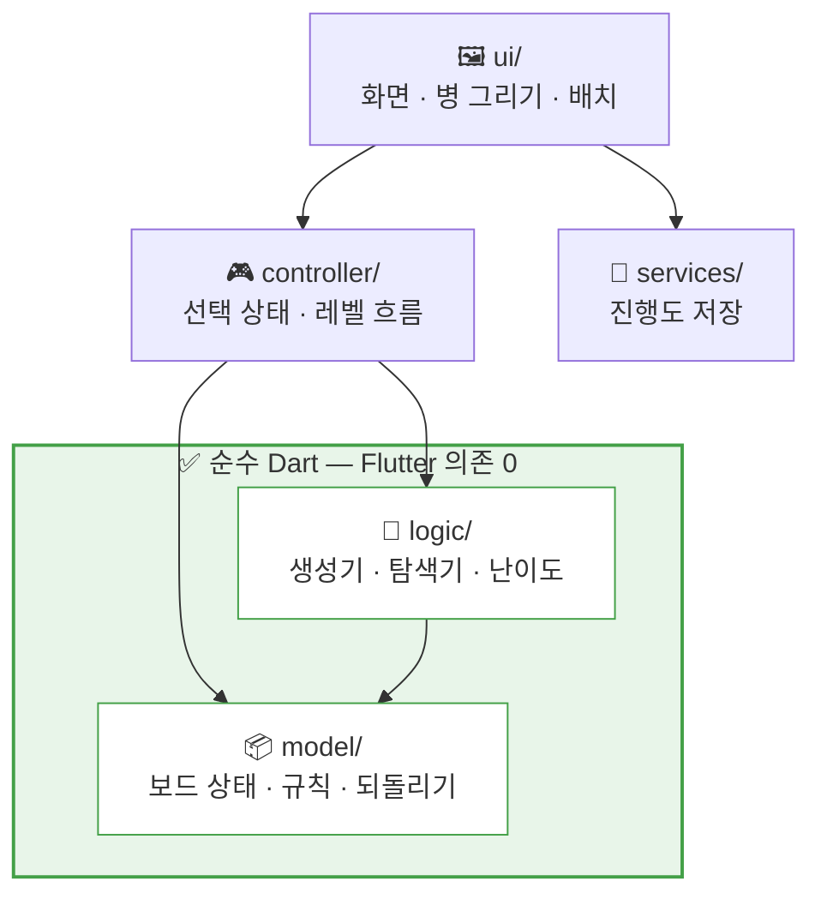

<div align="center">

# 🧪 BottleBottle · 물병 정렬

### *색을 맞춰 병을 채우는, 막히지 않는 퍼즐*

**광고 없음 · 결제 없음 · 하트 없음 · 인터넷 없음**
힌트도 되돌리기도 **무제한**. 레벨은 **무한**.

<br>


```
      ▁▁▁     ▁▁▁     ▁▁▁     ▁▁▁     ▁▁▁     ▁▁▁
     │▓▓▓│   │░░░│   │   │   │▒▒▒│   │▓▓▓│   │   │
     │▒▒▒│   │▓▓▓│   │   │   │░░░│   │▓▓▓│   │   │
     │░░░│   │▒▒▒│   │▒▒▒│   │▓▓▓│   │▓▓▓│   │   │
     │▓▓▓│   │░░░│   │▒▒▒│   │░░░│   │▓▓▓│   │   │
      ╰─╯     ╰─╯     ╰─╯     ╰─╯     ╰─╯     ╰─╯
       ①       ②       ③       ④    ✨완성✨   빈 병
```

</div>

---

## 🎯 왜 만들었나

> 원작 [Magic Sort!](https://play.google.com/store/apps/details?id=com.grandgames.magicsort&hl=ko)를 재미있게 하시다가,
> **과금 없이는 고층에서 더 못 나아가는 벽**에 막히셨다.
> 그래서 그 벽이 처음부터 없는 버전을 직접 만들었다.

|  | 원작에서 겪은 것 | 여기서는 |
|:--|:--|:--|
| 💔 | 하트가 떨어지면 대기 | **없음.** 언제든 계속 |
| 📺 | 광고를 봐야 힌트 | **무제한 힌트.** 볼 광고가 없음 |
| 💳 | 고층 진행에 결제 유도 | **결제 화면 자체가 없음** |
| 🔒 | 잠긴 폴더 | **모든 폴더가 처음부터 열려 있음** |
| 📶 | 접속 필요 | **비행기 모드에서도 100% 동작** |
| 🧱 | 안 풀리면 끝 | **건너뛰기 자유.** 벌칙 없음 |

<div align="center">

**대상 사용자: 어머니 한 분.** 스토어 등록도, 상업화도 하지 않는다.
APK 파일을 직접 만들어 드린다.

</div>

---

## 🕹️ 규칙은 30초면 끝난다

```
 ①  병을 탭한다        →  맨 위 색 덩어리가 들린다
 ②  다른 병을 탭한다    →  쪼르륵, 부어진다
 ③  모든 병이 한 색이 되면  →  🎉 완성
```

**부을 수 있는 조건** — 받는 병이 *비어 있거나*, *맨 위 색이 같고* 빈 칸이 남아 있을 것.
같은 색이 연속으로 쌓여 있으면 **한 번에 통째로** 넘어간다.
같은 병을 다시 누르면 취소. 그게 전부다.

---

## 📈 난이도는 세 축으로 오른다

<div align="center">

| 축 | 어떻게 어려워지나 |
|:--:|:--|
| 🎨 **색 가짓수** | 4색 → 15색. **여기서 멈춘다** |
| 📏 **병 깊이** | 4칸 → 8칸. 멀리 내다봐야 풀린다 |
| 🫙 **빈 병** | 2개 → 1개. 숨 쉴 곳이 사라진다 |

</div>

| 레벨 | 색 | 깊이 | 빈 병 | 병 | 체감 |
|--:|--:|--:|--:|--:|:--|
| `1–5` | 4 | 4칸 | 2 | 6 | 🟢 연습 |
| `6–20` | 5–6 | 4칸 | 2 | 7–8 | 🟢 연습 |
| `21–55` | 7–9 | 4칸 | 2 | 9–11 | 🔵 쉬움 |
| `56–100` | 10–12 | 4칸 | 2 | 12–14 | 🟡 보통 |
| `101–200` | 10–14 | **5칸** | 2 | 12–16 | 🟠 어려움 |
| `201–310` | 12–15 | **6칸** | 2 | 14–17 | 🔴 매우 어려움 |
| `311–420` | 13–15 | **7칸** | 2 | 15–17 | 🔴 매우 어려움 |
| `421–500` | 14–15 | **8칸** | 2 | 16–17 | ⚫ 최고 |
| `501+` | 15 | 8칸 | **1** | 16 | ⚫ 최고 유지 |

> 🎨 **색은 15가지에서 멈춘다.**
> 색을 스무 가지씩 쓰면 퍼즐이 아니라 **시력 검사**가 된다.
> 그 뒤로는 병을 깊게 해서 난이도를 올린다.
>
> 📐 **깊이가 늘어나는 구간에서는 색 수를 잠시 줄인다.**
> 두 축을 동시에 올리면 난이도가 계단이 아니라 **절벽**이 되기 때문.
> 이 규칙은 테스트가 강제한다.

---

## 📚 레벨 고르기 — 폴더 3단

**어떤 폴더도 잠겨 있지 않다.** 레벨 1인 사람도 최고 난이도를 지금 당장 열 수 있다.
잠금은 실력이 아니라 인내심을 시험하는 장치다.

```
📂 난이도 고르기                    ← 대분류
   ├── 🟢 연습          레벨 1~20    병 6~8개 · 4층      12/20 완성
   ├── 🔵 쉬움          레벨 21~55   병 9~11개 · 4층      3/35 완성
   ├── 🟡 보통          레벨 56~100  병 12~14개 · 4층     0/45 완성
   ├── 🟠 어려움        레벨 101~200 병 12~16개 · 5층     0/100 완성
   ├── 🔴 매우 어려움    레벨 201~420 병 14~17개 · 6~7층   0/220 완성
   └── ⚫ 최고 난이도    레벨 421~∞   병 16~17개 · 8층     0/… 완성
        │
        └── 📂 병 16개 · 8층         ← 중분류 (병 개수 · 층수)
            ├── 레벨 421~460  빈 병 2개
            ├── 레벨 461~500  빈 병 2개
            └── 레벨 501~550  빈 병 1개
                 │
                 └── 🔢 레벨 격자     ← 레벨 고르기
                     501 ✅  502 ✅  503     504     505 ...
```

| 단계 | 무엇으로 나누나 |
|:--|:--|
| **대분류** | 난이도 이름 — 연습 / 쉬움 / 보통 / 어려움 / 매우 어려움 / 최고 난이도 |
| **중분류** | **병 개수 · 층수** — 한 묶음 안에서는 판의 생김새가 변하지 않는다 |
| **레벨** | 격자에서 직접 고르기. 완성한 레벨엔 ✅ |

> 묶음 경계를 손으로 적지 않고 **난이도표에서 읽어 만든다.**
> 표를 고치면 화면이 저절로 따라오므로 둘이 어긋날 수 없다. 테스트가 이 일치를 검증한다.
>
> 안 한 레벨에는 **X도 자물쇠도 두지 않는다.** 빈칸을 표시로 채우면
> "못 한 것을 세는 화면"이 되기 때문.

---

## 🧠 두 개의 핵심 알고리즘

<table>
<tr>
<td width="50%" valign="top">

### 🔄 레벨 생성 — 역방향 셔플

완성된 상태에서 시작해 **한 수를 거꾸로 되감기**를 반복해 섞는다.
되감기로만 만들었으므로 **풀 수 있음이 구조적으로 보장**된다.

- 레벨 번호가 곧 시드 → 같은 레벨은 언제나 같은 판
- 채택 전 탐색기로 한 번 더 검증
- 실측 **레벨당 0~14ms**

</td>
<td width="50%" valign="top">

### 💡 힌트 — DFS 탐색기

**무제한 힌트**의 실체. 언제 눌러도 다음 한 수를 알려준다.

- 병 순서를 정규화해 같은 상태를 하나로 취급
- 수 정렬 휴리스틱 하나로 탐색량 **수십 배** 감소
- *"풀 수 없음"* 과 *"예산 초과라 모르겠음"* 을 구분

</td>
</tr>
</table>

<details>
<summary><b>🕳️ 구현하다 빠진 함정들 (펼치기)</b></summary>

<br>

**1. 앞으로 두는 수로는 영영 안 섞인다**
처음엔 "완성 상태에서 무작위로 수를 둬서 섞자"고 접근했다. 그런데 완성된 상태에서
둘 수 있는 수는 *가득 찬 병을 통째로 빈 병에 옮기기*뿐이라, 병의 **자리만 바뀌고 색은 안 섞였다**.
앞으로 두는 수와 되감는 수는 다른 연산이다. 되감기는 **임의의 k칸**을 옮길 수 있어야 한다.

**2. 되감기가 정확히 한 수로 복원되려면 두 조건이 필요하다**
① 받는 병은 비었거나 맨 위 색이 **달라야** 한다 (같으면 되돌릴 때 k칸보다 많이 들린다)
② k칸을 뗀 병은 그 색이 남아 있거나 **완전히 비어야** 한다 (아니면 되돌릴 때 물을 못 받는다)

**3. BFS는 색 12개에서 메모리가 터졌다**
힌트는 *"정답으로 가는 한 수"* 면 충분하고 최단성은 필요 없다. DFS로 갈아탔다.

**4. 난이도를 해답 길이로 재면 안 된다**
탐색기가 최단 해답을 보장하지 않으므로, 해답 길이는 판의 어려움이 아니라
**탐색기의 운**을 재게 된다. 대신 **색 조각 수**로 잰다. 그건 판 자체의 성질이다.
깊이를 8칸까지 늘렸을 땐 이 기준마저 헐거워져 8층 판이 27수 만에 끝났다.
기준을 **전체 칸 수에 비례**하도록 바꿔 해결.

**5. 테두리가 액체를 3픽셀 밀어냈다**
게다가 강조할 때 테두리를 굵게 했더니 병 크기가 들썩였다. 굵기는 고정하고 **색만** 바꾼다.

**6. 저장은 병 내용물이 아니라 수순으로 한다**
레벨 생성이 결정적이라 **레벨 번호 + 둔 수 목록**만 있으면 보드·되돌리기 기록·
빈 병 기록이 통째로 복원된다. 내용물을 저장하면 되돌리기 기록과 따로 놀아 깨진다.

**7. 빈 병 2개를 준다고 해놓고 하나가 차 있었다**
되감기 셔플은 빈 병을 즐겨 채우는데 **마지막 상태를 그대로 썼기** 때문.
0수인데 "빈 병 1/2 사용 중"으로 떴고, 빈 병 1개짜리 판에서 "2개를 모두 썼다"는 말까지 나왔다.
→ 섞는 **도중에** 조건을 만족하는 순간을 잡아 두었다가 그것을 판으로 쓴다.

</details>

---

## 🏗️ 구조



> **게임 로직은 Flutter를 전혀 모른다.**
> 그래서 화면 없이 단위 테스트로 검증된다. 버그를 눈으로 찾을 필요가 없다.

```
lib/
├── main.dart                     앱 진입점 · 테마
├── model/
│   ├── game_state.dart           보드 · 붓기 규칙 · 승리 판정 · 되돌리기
│   └── move.dart                 한 수의 표현 (from, to, count, color)
├── logic/
│   ├── generator.dart            역방향 셔플 레벨 생성
│   ├── solver.dart               해답 탐색 (힌트)
│   ├── level_config.dart         레벨 번호 → 난이도 파라미터
│   └── level_groups.dart         난이도(대분류) · 병 구성(중분류) 묶음
├── controller/
│   └── game_controller.dart      화면 ↔ 로직 연결 (ChangeNotifier)
├── ui/
│   ├── screens/                  게임 · 난이도 · 병 구성 · 레벨 선택
│   ├── widgets/                  병 그리기 · 반응형 배치 · 폴더 카드
│   └── theme/palette.dart        15색 팔레트 + 색약 기호
└── services/storage.dart         진행도 · 설정 저장
```

**의존 패키지는 `shared_preferences` 하나뿐이다.** 몇 년 뒤에도 빌드가 깨지지 않도록.

---

## ✨ 편의 기능 — 전부 무제한

<div align="center">

| ↩️ 되돌리기 | 💡 힌트 | 🔄 다시 | ⏭️ 건너뛰기 |
|:--:|:--:|:--:|:--:|
| 무제한 | 무제한 | 무제한 | 벌칙 없음 |

| 💾 자동 저장 | 📂 레벨 자유 선택 | 👁️ 색약 모드 | 🫙 빈 병 사용량 |
|:--:|:--:|:--:|:--:|
| 앱을 꺼도 그대로 | 모든 폴더 개방 | 색마다 도형 기호 | 얼마나 아꼈나 기록 |

</div>

> 🫙 **빈 병 사용량**은 단순히 "지금 몇 개 비었나"가 아니라
> 판을 푸는 동안 **동시에 점유했던 빈 병의 최대값**이다.
> 색을 완성해 병을 비우면 처음보다 빈 병이 늘 수도 있기 때문.
> 빈 병 2개를 받고 1개로 풀었다면, 수를 적게 둔 것보다 훨씬 잘 푼 것이다.
> 되돌리기를 하면 이 기록도 함께 되돌아간다.

**그리고 못한 것은 지적하지 않는다.** 아꼈으면 칭찬하고, 다 썼으면 담담히 사실만 적는다.
잘해야 한다는 압박을 주는 순간 이 게임의 취지가 무너진다.

---

## 🧭 개발 현황

```
0단계  환경 구축                ████████████████████  ✅ 완료
1단계  순수 로직 + 테스트        ████████████████████  ✅ 완료
2단계  최소 플레이 가능 UI       ████████████████████  ✅ 완료
3단계  게임 화면 완성            ████████████████████  ✅ 완료
3.5단계 레벨 선택 폴더 3단        ████████████████████  ✅ 완료
4단계  꾸밈 (연출 · 소리 · 테마)  ░░░░░░░░░░░░░░░░░░░░  🚧 진행 중
5단계  아이콘 · 서명 APK · 전달   ░░░░░░░░░░░░░░░░░░░░  ⏳ 예정
6단계  어머니 피드백 반영         ░░░░░░░░░░░░░░░░░░░░  ⏳ 예정
```

**4단계에서 넣을 것** — 병이 기울고 물줄기가 곡선을 그리는 붓기 애니메이션,
부은 직후 수면 출렁임, 클리어 색종이, 잘못된 수에 병 흔들기,
쪼르륵 효과음(붓는 양에 따라 길이가 달라진다), 라이트/다크 테마, 통계 화면.
**BGM은 넣지 않는다** — 오래 하면 피로하다.

<div align="center">

📄 자세한 설계와 결정 근거는 **[PLAN.md](PLAN.md)** 에 있다.

</div>

---

## 🛠️ 빌드

```bash
flutter pub get           # 의존성 (딱 하나)
flutter test              # 테스트 110개
flutter analyze           # 경고 0건
flutter run               # 연결된 기기에서 실행
flutter build apk --release
```

<details>
<summary><b>개발 환경</b></summary>

<br>

| 항목 | 버전 |
|:--|:--|
| Flutter | 3.47.0 stable (Dart 3.13.0) |
| JDK | Temurin 17 |
| Android SDK | Platform 36 · Build-Tools 36.0.0 |

`flutter doctor`의 Visual Studio 미설치 경고는 **Windows 데스크톱 빌드용**이라 이 프로젝트와 무관하다.

</details>

<details>
<summary><b>테스트가 지키는 것</b></summary>

<br>

- **규칙** — 붓기 조건, 부분 이동, 승리 판정, 되돌리기가 정확히 복원되는가
- **탐색기** — 찾은 해답을 규칙 위에서 **실제로 재생해** 정말 이기는지. 힌트만 눌러 끝까지 가면 이기는지
- **생성기** — 레벨 1~100 + 고레벨 표본이 전부 풀리는가, 색 개수, 재현성, 헝클어짐 하한선
- **약속** — 난이도표에 적은 빈 병 개수가 시작 판에서 실제로 지켜지는가
- **난이도** — 깊이와 색 수가 **동시에** 오르지 않는가
- **폴더** — 묶음이 빈틈없이 이어지는가, 한 묶음 안에서 판의 생김새가 변하지 않는가
- **화면** — 작은 폰~큰 폰 3종 × 레벨 8구간에서 화면 넘침이 없는가

</details>

---

<div align="center">

### 🚫 이 앱에 영원히 들어가지 않는 것

`광고` · `결제` · `하트/에너지` · `로그인` · `네트워크 통신` · `광고 시청 보상` · `잠긴 레벨`

<br>

**어머니를 위해 만들었습니다.** 🫙💙

</div>
